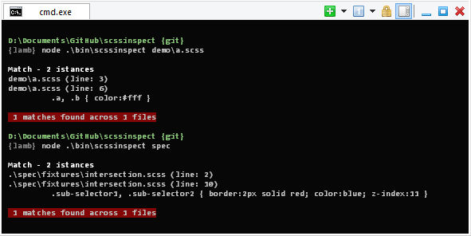
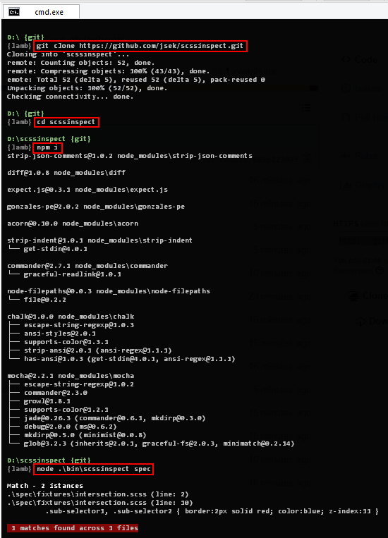

Detect copy-pasted and structurally similar code in your Scss stylesheets.

* [Overview](#overview)
* [Installation](#installation)
* [Usage](#usage)
* [Known issues](#known-issues)

## Overview

One example means more than thousand words:



## Installation



## Usage

```
Usage: scssinspect [options] <paths ...>

Duplicate code and structure detection for Scss.
Values matching is enabled by default. Example use:
scssinspect --ignore "merged.scss" ./path/to/src

Options:

  -h, --help                         output usage information
  -V, --version                      output the version number
  -c, --config                       path to config file (default: .scssinspectrc)
  -D, --no-diff                      disable 2-way diffs
  -C, --no-color                     disable colors
  --ignore <pattern>                 ignore paths matching a regex
```

If a `.scssinspectrc` file is located in the project directory, its values will
be used in place of the defaults listed above. For example:

``` javascript
{
  "ignore"        : "bootstrap|legacy|lib", // used as RegExp
}
```

## Known issues
    
 - Parser issues
    - throws error while parsing selector with interpolation
    
 - Parser patch 1: gonzales.css-to-ast.js:1308 (adding end location for ruleset)
    
``` javascript
if (needInfo)
{
    var _info = getInfo(startPos);
    if (tokens[pos-1]) {
        _info.end = getInfo(pos-1);
    }
    return (x.unshift(_info), x);
} else {
    return x;
}
```

 - Parser patch 2: gonzales.css-to-ast.js:1671 (increasing line number while parsing block comments)
    
``` javascript
c = css.charAt(pos);
cn = css.charAt(pos + 1);
if (c === '\n' || c === '\r') ln++;
if (c === '*' && cn === '/') { ...
```