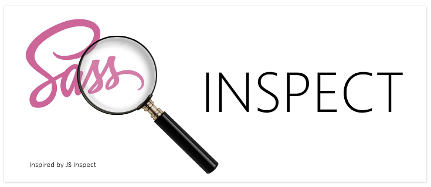
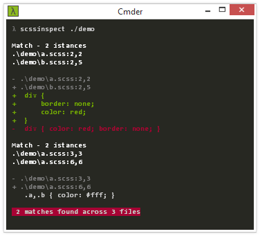

Detect copy-pasted and structurally similar code in your Scss stylesheets.


[](https://nodei.co/npm/scssinspect.png?downloads=true)

[](https://david-dm.org/jsek/scssinspect) 
[](https://github.com/jsek/scssinspect/blob/master/LICENSE)
[](https://npmjs.org/package/scssinspect) 
[](https://github.com/jsek/scssinspect/releases) 

* [Overview](#overview)
* [Installation](#installation)
* [Usage](#usage)
* [Known issues](#known-issues)
* [Required parser patches](#required-parser-patches)

## Overview

One example means more than thousand words:



## Installation

Global installation (recommended):

```
npm i -g scssinspect
```

## Usage

```
Usage: scssinspect [options] <paths ...>

Duplicate code and structure detection for Scss.
Values matching is enabled by default. Example use:
scssinspect --ignore "merged.scss" ./path/to/src

Options:

  -h, --help                         output usage information
  -V, --version                      output the version number
  -c, --config                       path to config file (default: .scssinspectrc)
  -s, --skip                         skip files with parsing errors
  -D, --no-diff                      disable 2-way diffs
  -C, --no-color                     disable colors
  --ignore <pattern>                 ignore paths matching a regex
```

If a `.scssinspectrc` file is located in the project directory, its values will
be used in place of the defaults listed above. For example:

``` javascript
{
  "ignore"        : "bootstrap|legacy|lib", // used as RegExp
}
```

## Known issues
        
 - Parser issues:
    - @media queries cause infinite loop
    - inline if() statements are not supported

## Required parser patches

 Scss parser (gonzales@2.0.2) is copied into /parser directory with following patches applied:
        
 - Parser patch 1: adding end location for ruleset
    
``` javascript
// gonzales.css-to-ast.js: modified line 1308
if (needInfo)
{
    var _info = getInfo(startPos);
    if (tokens[pos-1]) {
        _info.end = getInfo(pos-1);
    }
    return (x.unshift(_info), x);
} else {
    return x;
}
```

 - Parser patch 2: increasing line number while parsing block comments
    
``` javascript
// gonzales.css-to-ast.js: modified after line 1671
var start = pos, c, cn;
for (pos = pos + 2; pos &lt; css.length; pos++) {
    c = css.charAt(pos);
    cn = css.charAt(pos + 1);
    if (c === '\n' || c === '\r') ln++;
    if (c === '*' && cn === '/') { ...
```

 - Parser patch 3: fixing interpolation after minus sign
    
``` javascript
// gonzales.css-to-ast.js: modified line 1983
if (!wasIdent && tokens[start].type !== TokenType.Asterisk && l === 0) return 0;
// the quickest version, 'l' means there was interpolation for identifier
```

 - Parser patch 4: fixing direct interpolation in selector
    
``` javascript
/* gonzales.css-to-ast.js */
// modified line 2263 
if (l = this.checkVariable(i) || this.checkIdent(i) || this.checkInterpolatedVariable(i)) i += l;

// modified line 2271
x.push(  this.checkVariable(pos) ? this.getVariable() 
       : this.checkInterpolatedVariable(pos) ? this.getInterpolatedVariable() 
       : this.getIdent());

// added in line 2331 
this.checkInterpolatedVariable(i) ||

// added in line 2343
else if (this.checkInterpolatedVariable(pos)) return this.getInterpolatedVariable();
```

 - Other changes to the parser are visible in the history of /parser/gonzales.css-to-ast.js.